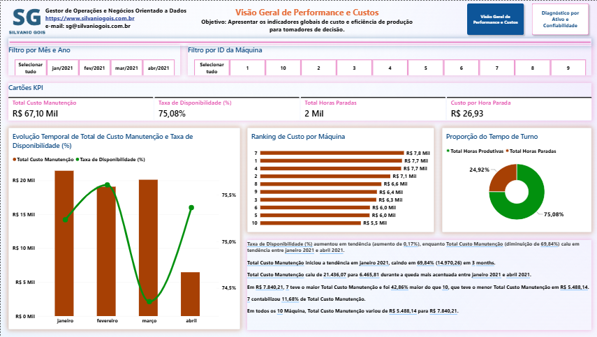
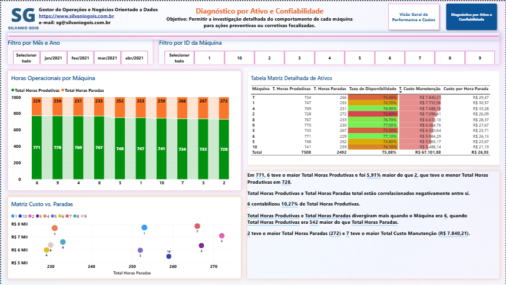

# Dashboard Executivo de Gestão da Manutenção Industrial (PCM)

Este repositório contém a solução completa de Business Intelligence desenvolvida para o **Planejamento e Controle de Manutenção (PCM)**. O objetivo principal do projeto é monitorar indicadores chave de performance (KPIs) operacionais e financeiros de um parque fabril composto por 10 equipamentos ativos, analisando dados operacionais entre janeiro e abril de 2021.

---

## Links do Projeto

* **Dashboard Interativo (Power BI Web):** [Acessar Relatório Online](https://app.powerbi.com/view?r=eyJrIjoiNTI5ODg4Y2EtZGNhNi00MzQ3LTlhNzktYTMyZDAxYzc4MTU1IiwidCI6IjJlYmQyYzU0LWY1ZDMtNGVmYi05ZGE3LWU4Yzk0YmQyMWQzOSJ9)
* **Website Profissional:** [https://www.silvaniogois.com.br](https://www.silvaniogois.com.br)
* **LinkedIn:** [https://www.linkedin.com/in/silvanio-gois/](https://www.linkedin.com/in/silvanio-gois/)
* **GitHub:** [https://github.com/SilvanioSG](https://github.com/SilvanioSG)

---

## Visão Geral do Projeto e Objetivos de Negócio

No contexto de **Planejamento e Controle de Manutenção (PCM)**, a disponibilidade e os custos operacionais são fatores críticos de eficiência fabril. Interrupções não planejadas e custos elevados de reparo comprometem a produtividade e a margem operacional.

### Objetivos Principais:
1. **Acompanhamento Financeiro:** Controlar os gastos acumulados com manutenção e avaliar a evolução mensal dos custos.
2. **Medição de Eficiência:** Monitorar a **Taxa de Disponibilidade (%)** global e por equipamento, garantindo alinhamento com a meta fabril (≥ 75%).
3. **Análise de Custo e Paradas:** Avaliar a relação financeira por hora de inatividade ($R\$/h$) para priorizar intervenções de manutenção preditiva e preventiva.
4. **Matriz de Diagnosticabilidade:** Identificar equipamentos gargalo através da combinação do volume de paradas e custos acumulados.

---

## Estrutura de Dados e Modelagem

O projeto utiliza a arquitetura de modelagem em estrela (*Star Schema*), separando registros transacionais de tabelas de dimensão de tempo.

### 1. Tabela Fato (`fManutencao`)
Contém 1.000 registros transacionais com as seguintes colunas de dados brutos:
* **Data:** Data da ocorrência ou apontamento de turno.
* **Máquina:** Identificador numérico do ativo (tratado no ETL como texto para evitar somatórios incoerentes).
* **Horas Produtivas:** Tempo em que a máquina operou efetivamente durante o turno.
* **Horas Paradas:** Tempo em inatividade devido a falhas, ajustes ou manutenções.
* **Custo Manutenção:** Custo financeiro direto aplicado no evento (R$).

### 2. Tabela Dimensão Calendário (`dCalendario`)
Gerada via DAX para assegurar inteligência temporal contínua e sem lacunas:

```dax
dCalendario = 
ADDCOLUMNS (
    CALENDAR(MIN(fManutencao[Data]), MAX(fManutencao[Data])),
    "Ano", YEAR([Date]),
    "Mês Num", MONTH([Date]),
    "Nome do Mês", FORMAT([Date], "mmm"),
    "Mês/Ano", FORMAT([Date], "mmm/yyyy"),
    "Dia da Semana", FORMAT([Date], "ddd")
)
```

### Relacionamentos
* **`dCalendario[Date]` (1)** $\rightarrow$ **`fManutencao[Data]` (*)** com cardinalidade 1 para N.

---

## Medidas DAX e Modelagem Matemática

Abaixo estão listadas as medidas DAX criadas no modelo, juntamente com a fundamentação matemática aplicada para garantir a consistência das análises.

| Nome da Medida | Fórmula DAX | Descrição e Unidade |
| :--- | :--- | :--- |
| **Total Custo Manutenção** | `SUM(fManutencao[Custo Manutenção])` | Somatório total do custo financeiro com intervenções (R$). |
| **Total Horas Produtivas** | `SUM(fManutencao[Horas Produtivas])` | Volume total de horas operacionais efetivas (h). |
| **Total Horas Paradas** | `SUM(fManutencao[Horas Paradas])` | Volume total de horas em inatividade/manutenção (h). |
| **Total Horas Turno** | `[Total Horas Produtivas] + [Total Horas Paradas]` | Horas totais planejadas de operação (h). |
| **Taxa de Disponibilidade (%)** | `DIVIDE([Total Horas Produtivas], [Total Horas Turno], 0)` | Proporção de tempo em que a máquina esteve disponível para produção. |
| **Taxa de Indisponibilidade (%)**| `DIVIDE([Total Horas Paradas], [Total Horas Turno], 0)` | Proporção de tempo perdido devido a paradas. |
| **Custo por Hora Parada** | `DIVIDE([Total Custo Manutenção], [Total Horas Paradas], 0)` | Severidade financeira imputada a cada hora de máquina parada (R$/h). |
| **Custo por Hora Produtiva** | `DIVIDE([Total Custo Manutenção], [Total Horas Produtivas], 0)` | Impacto financeiro de manutenção distribuído por hora produzida (R$/h). |

---

## Estrutura das Páginas do Dashboard

### Página 1: Visão Geral de Performance e Custos
*Objetivo: Apresentar os indicadores globais de custo e eficiência de produção para tomadores de decisão.*



#### Componentes Visuais:
1. **Filtros Globais:** Slicers interativos por Mês/Ano e por ID da Máquina.
2. **Cartões de KPI:**
   * **Total Custo Manutenção:** R$ 67,10 Mil acumulados no período.
   * **Taxa de Disponibilidade (%):** 75,08% global (alinhado à meta estipulada de ≥75%).
   * **Total Horas Paradas:** 2.492 horas de inatividade total.
   * **Custo por Hora Parada:** R$ 26,93 por hora parada.
3. **Evolução Temporal de Custo e Disponibilidade (Linhas e Colunas):**
   * Avalia a redução substancial dos custos entre janeiro (R$ 21,44 mil) e abril (R$ 6,47 mil) — uma redução de **69,84%** nos custos mensais.
   * Mostra a oscilação da taxa de disponibilidade ao longo dos meses, fechando abril em 75,3%.
4. **Ranking de Custo por Máquina (Barras Horizontais):**
   * Classifica as máquinas com maior gasto acumulado. Destaque para as **Máquinas 7 (R$ 7,8 mil)**, **1 (R$ 7,7 mil)** e **4 (R$ 7,7 mil)**.
5. **Proporção do Tempo de Turno (Gráfico de Rosca):**
   * Ilustra a distribuição percentual de utilização do parque fabril: **75,08%** de tempo produtivo versus **24,92%** de tempo parado.

---

### Página 2: Diagnóstico por Ativo e Confiabilidade
*Objetivo: Permitir a investigação detalhada do comportamento de cada máquina para ações preventivas ou corretivas focalizadas.*



#### Componentes Visuais:
1. **Horas Operacionais por Máquina (Colunas Empilhadas):**
   * Exibe a divisão de horas produtivas e horas paradas para cada uma das 10 máquinas do parque.
2. **Matriz Custo vs. Paradas (Gráfico de Dispersão / Scatter Plot):**
   * Correlaciona o **Total de Horas Paradas (Eixo X)** com o **Total Custo Manutenção (Eixo Y)**.
   * Permite identificar máquinas no quadrante crítico (alta inatividade e alto custo), como as **Máquinas 7 e 2**.
3. **Tabela Matriz Detalhada de Ativos:**
   * Lista detalhada de todos os ativos contendo: Horas Produtivas, Horas Paradas, Taxa de Disponibilidade, Custo de Manutenção e Custo por Hora Parada.
   * **Formatação Condicional:** Aplicação de gradiente de cores (Verde/Amarelo/Vermelho) na Taxa de Disponibilidade e barras de dados no Custo total.

---

## Insights e Conclusões da Análise

A análise dos dados do período de janeiro a abril de 2021 sobre os 10 equipamentos resultou nas seguintes conclusões estratégicas:

1. **Redução Acentuada no Gasto Mensal:** O custo de manutenção apresentou uma queda de **69,84%**, saindo de R$ 21.436,07 em janeiro para R$ 6.465,81 em abril, demonstrando ganho de eficiência nas intervenções ao longo do primeiro quadrimestre.
2. **Equipamento Crítico (Máquina 7):**
   * A **Máquina 7** apresentou o maior custo total de manutenção do parque: **R$ 7.840,21** (representando **11,68%** de todo o custo fabril).
   * Possui uma disponibilidade de apenas **73,40%** (abaixo da meta de 75%), acumulando 266 horas paradas e o maior custo por hora parada do parque (**R$ 29,47/h**).
3. **Máquina 2 (Gargalo de Disponibilidade):**
   * A **Máquina 2** acumulou o maior número de horas paradas entre todos os ativos (**272 horas**), resultando na menor taxa de disponibilidade do parque (**72,80%**) e um custo de R$ 7.096,41.
4. **Ativos de Alta Performance (Máquinas 9 e 4):**
   * A **Máquina 9** obteve a maior taxa de disponibilidade do parque (**77,00%**), com 770 horas produtivas e 230 horas paradas.
   * A **Máquina 6** registrou o maior volume de horas produtoras absolutas (**771 horas**).

---

## Estrutura de Arquivos do Repositório

```text
├── Gestao_da_Manutencao.xlsx         # Base de dados bruta original em Excel
├── BI_PCM_Gestao_da_Manutencao_v1.pbix # Arquivo fonte do Power BI Desktop
├── BI_PCM_Gestao_da_Manutencao_v1.pdf  # Relatório exportado em formato PDF
├── pagina1.jpg                         # Imagem da Visão Geral de Performance e Custos
├── pagina2.jpg                         # Imagem do Diagnóstico por Ativo e Confiabilidade
└── README.md                           # Documentação do projeto
```

---

## Como Executar o Projeto Localmente

1. **Clone o repositório:**
   ```bash
   git clone https://github.com/SilvanioSG/Dashboard-Executivo-de-Gestao-da-Manutencao-Industrial-PCM
   ```
2. **Abrir o projeto no Power BI Desktop:**
   * Baixe e instale o [Power BI Desktop](https://powerbi.microsoft.com/desktop/).
   * Abra o arquivo `BI_PCM_Gestao_da_Manutencao_v1.pbix`.
3. **Atualização da Fonte de Dados (Caso necessário):**
   * Se alterar a pasta do projeto, vá em `Transformar Dados` > `Configurações da Fonte de Dados` e reaponte o caminho do arquivo `Gestao_da_Manutencao.xlsx`.

---

## Autor e Contato

**Silvanio Gois**  
*Gestor de Operações e Negócios Orientado a Dados*

* **Website:** [www.silvaniogois.com.br](https://www.silvaniogois.com.br)
* **LinkedIn:** [linkedin.com/in/silvanio-gois](https://www.linkedin.com/in/silvanio-gois/)
* **GitHub:** [github.com/SilvanioSG](https://github.com/SilvanioSG)
